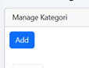
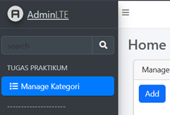
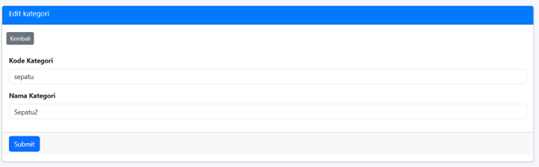
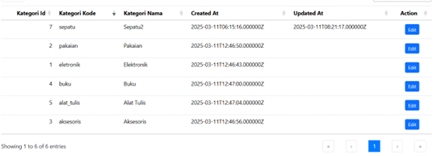
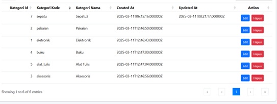

# Jobsheet 5 Blade View, Web Templating(AdminLTE), Datatables (VERSI REVISI)
[Bawa Aku Kesana](../week-7/)
# Jobsheet 5 - Blade View, Web Templating(AdminLTE), Datatables (VERSI LAMA!!!)
Commits: [Jobsheet-5](https://github.com/search?q=repo%3ARaruu%2FPolinema.Task+weblnjt%2FJS5&type=commits)

### Laporan JS5 ada di [sini](https://1drv.ms/f/c/60e6043c8101a60a/EqL_CGeINmZNj3vWWNmJvoMB4nby17qHOW8uTixmDTTCDQ?e=WwXetD)

# Tugas Praktikum
[Commit](https://github.com/Raruu/Polinema.Task/commit/c1bce239963c5aba6a82476604c651535663d1a0) Praktikum

#### 1. Tambahkan button Add di halam manage kategori, yang mengarah ke create kategori baru
>

>  
>

#### 2. Tambahkan menu untuk halaman manage kategori, di daftar menu navbar
>

>  
>

#### 3. Tambahkan action edit di datatables dan buat halaman edit serta controllernya
>

>  
>  
>

#### 4. Tambahkan action delete di datatables serta controllernya
>

>  
>

