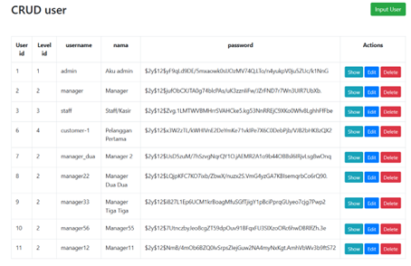
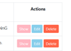

# Jobsheet 6 - Template Form (AdminLTE), Server Validation, Client Validation, CRUD 

Commits: [Jobsheet-6](https://github.com/search?q=repo%3ARaruu%2FPolinema.Task+JS6&type=commits)

### Laporan JS6 ada di [sini](https://1drv.ms/f/c/60e6043c8101a60a/EqL_CGeINmZNj3vWWNmJvoMB4nby17qHOW8uTixmDTTCDQ?e=WwXetD)

# Tugas
#### 1.	Coba tampilkan level_id pada halaman web tersebut dimana field ini merupakan foreign key 
>

>  
>

#### 2.	Modifikasi dengan tema/ template kesukaan Anda 
> Mengganti warna tema pada tombol
>

>  
>

#### 3.	Apa fungsi $request->validate, $error dan alert yang ada pada halaman CRUD tersebut
>
> - $request->validate\
>mengvalidasi data yang dikirimkan melalui request sebelum diproses lebih lanjut
>- $error\
>adalah message error bag, variabel yang menyimpan pesan error validasi di halaman view
> - Alert\
>biasanya digunakan untuk menampilkan notifikasi sukses, warning, atau error setelah operasi CRUD selesai
