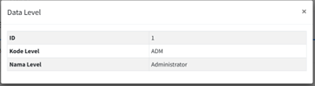
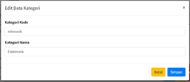

# Jobsheet 6 - Ajax Form (AdminLTE) dan Client Validation 

Commits: [Jobsheet-6](https://github.com/search?q=repo%3ARaruu%2FPolinema.Task+JS6&type=commits)

### Laporan JS6 ada di [sini](https://1drv.ms/f/c/60e6043c8101a60a/EqL_CGeINmZNj3vWWNmJvoMB4nby17qHOW8uTixmDTTCDQ?e=WwXetD)

# Tugas Jobsheet
Implementasikan koding untuk Ajax Form dan Client Validation dengan jQuery Validation pada pada menu berikut ini 
>

>
Tabel m_level

>

>  
>  
>  
>

>

>

>
Tabel m_kategori 

>

>  
>  
>  
>

>

>

>
Tabel m_supplier

>

>  
>  
>  
>

>

>

>
Tabel m_barang

>

>  
>  
>  
>

>

