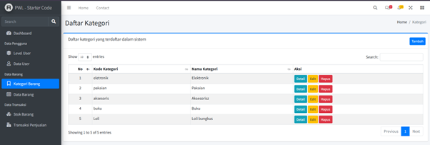
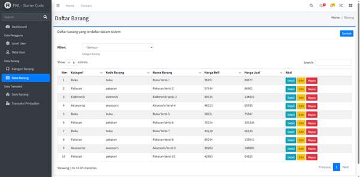
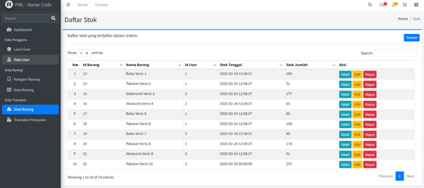
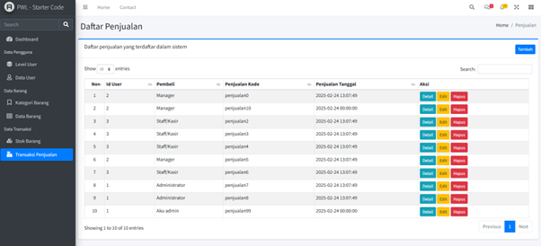

# Jobsheet 5 Blade View, Web Templating(AdminLTE), Datatables
Jobsheet 7 - PWL – LARAVEL STARTER CODE (Nama Jobsheet yang lama)\
kedua Jobsheet memiliki isi yang sama\
[Commits](https://github.com/search?q=repo%3ARaruu%2FPolinema.Task+JS7&type=commits)

### Laporan JS5 ada di [sini](https://1drv.ms/f/c/60e6043c8101a60a/EqL_CGeINmZNj3vWWNmJvoMB4nby17qHOW8uTixmDTTCDQ?e=WwXetD)

# Pertanyaan JS5 (JS7 PWL – LARAVEL STARTER CODE)
#### 1.	Apa perbedaan frontend template dengan backend template? 
> - Frontend: Saat membuka halaman web, frontend template akan menampilkan layout, tombol, dan form.
> - Backend: Saat mengirim form, backend template akan memproses data tersebut, menyimpannya ke database, dan mengirim respons kembali ke frontend.
 #### 2.	Apakah layouting itu penting dalam membangun sebuah website? 
> Ya, untuk mengatur tata letak elemen-elemen visual pada halaman web
#### 3.	Jelaskan fungsi dari komponen laravel blade berikut : 
>-	@include()\
>Memasukkan view lain ke dalam view saat ini
>-	@extend()\
>Mewarisi struktur layout dari file Blade lain sebagai parent
>-	@section()\
>Mendefinisikan bagian konten yang akan diisi ke layout parent
>-	@push()\
>Menambahkan konten ke named stack
>-	@yield()\
>Menampilkan konten dari section yang didefinisikan pada child 
>-	@stack()\
>Menampilkan semua konten yang di-push ke stack tertentu
#### 4.	Apa fungsi dan tujuan dari variable $activeMenu ? 
>variable $activeMenu berfungsi untuk memberi tahu view mana menu yang active/sedang digunakan

# Tugas Praktikum JS5
Implementasikan menu yang belum ada di laravel starter code ini sesuai dengan Studi Kasus Point of Sales Sederhana. Silahkan terapkan kode di laravel starter code untuk menu-menu yang sesuai dengan menu.\
\
[Commit-1](https://github.com/Raruu/Polinema.Task/commit/a1a52e56c14939d984089757febc73ba8d0bbc17)\
[Commit-2](https://github.com/Raruu/Polinema.Task/commit/7fdbf64a5f5a1f58f3c384ca31582450a6bc6933)

Hasil

  
  
  
  

